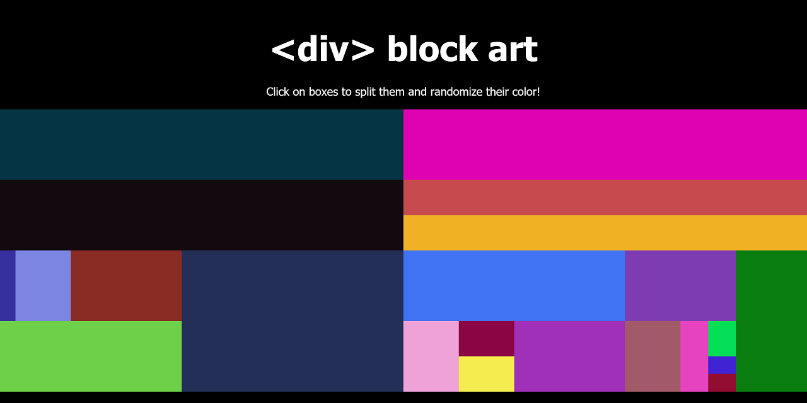

# \<div\> block art
A fun thing I made to practice JavaScript DOM manipulation. [Visit the **web page** to try...](https://ellenlloyd.ca/div-art/) It's strangely addicting!

 block art: click to create and change!" title="Div Art" width="800"/>

Fun fact: the initial html \<body\> for this is barely 8 lines:

```html
<header>
  <h1>&lt;div&gt; block art</h1>
  <p>Click on boxes to split them and randomize their color!</p>
</header>

<section>
  <div class="first art"></div>
</section>

<script src="div-art.js"></script>
```
